# MeowKit React Library (Unofficial)

Unofficial community MeowKit React UI library for Companion App and IDE surfaces — design tokens, accessible components, Storybook docs, and presentational Monaco/Companion panels. Not affiliated with or endorsed by the official MeowKit project.

Design overview: [`docs/design.md`](docs/design.md).

## Packages

- `@meowkit/design-tokens`
- `@meowkit/global-styles`
- `@meowkit/components`

This repository is intended for public GitHub consumption (workspace / git dependency). npm registry publishing is optional and not required to use the library.

## Examples

### Consume like a Companion App

[`examples/companion-ide`](examples/companion-ide) is a Vite + React workspace app that shows how to compose the Companion IDE shell with MeowKit path imports and mock state only (no WebSerial, WebUSB, or flash backends in the library).

It wires:

- `MeowKitProvider`, `AppLayout`, `Sidebar`, and `FileExplorerTree` for navigation
- `IDEToolbar` and `MonacoEditor` for the main editor surface
- `BuildOutputPanel` and `SerialConsoleView` in the tools drawer
- `StatusBar` with a mock connect/disconnect toggle

Install Monaco peers in your app when you use `@meowkit/components/monaco-editor` (the example already includes them):

```bash
npx pnpm@9.15.0 add monaco-editor @monaco-editor/react
```

Run the example after building workspace packages:

```bash
pnpm build
pnpm --filter=@meowkit/example-companion-ide dev
```

Production build:

```bash
pnpm --filter=@meowkit/example-companion-ide build
```

Use `examples/companion-ide/src/App.tsx` as a starting point for your own Companion App — swap mock handlers for real device I/O in your host app, not inside `@meowkit/components`.

## Quick start

```bash
corepack enable
pnpm install
pnpm build
pnpm storybook
```

On Windows without Corepack (or if `corepack enable` fails with EPERM), use `npx pnpm@9.15.0` for every `pnpm` command:

```bash
npx pnpm@9.15.0 install
npx pnpm@9.15.0 build
npx pnpm@9.15.0 storybook
```

Build the workspace packages before Storybook or the export smoke check. Storybook and `pnpm smoke` read compiled `dist` entries, not source.

```bash
pnpm build
pnpm test
pnpm smoke
```

## Usage

Importing `@meowkit/global-styles` injects light + default CSS variables on `:root`, so first paint works without JavaScript. `MeowKitProvider` also applies mode and accent in `useLayoutEffect` before the browser paints.

Optional spec bootstrap: call `applyMode` / `applyAccent` before React renders (needed for a non-default theme on first paint):

```tsx
import '@meowkit/global-styles';
import { applyAccent, applyMode } from '@meowkit/global-styles';
import { MeowKitProvider } from '@meowkit/components/provider';
import Button from '@meowkit/components/button';
import { createRoot } from 'react-dom/client';

applyMode('light');
applyAccent('default');

createRoot(document.getElementById('root')!).render(
  <MeowKitProvider mode="light" accent="default">
    <Button variant="primary">Continue</Button>
  </MeowKitProvider>,
);
```

`pnpm smoke` asserts compiled `dist` exports for every `@meowkit/components` public entry and that Button CSS is emitted. It does not rebuild — run `pnpm build` first.

## CI

Pull requests and pushes to `main` run [`.github/workflows/ci.yml`](.github/workflows/ci.yml):

1. `pnpm install --frozen-lockfile`
2. `pnpm build` (Node heap raised to 8192 MB for declaration emit)
3. `pnpm test`
4. `pnpm typecheck`
5. `pnpm smoke`

Storybook static docs deploy to GitHub Pages from [`.github/workflows/storybook.yml`](.github/workflows/storybook.yml) on pushes to `main` (requires Pages enabled on the repository).

See [CONTRIBUTING.md](CONTRIBUTING.md) for the full contributor workflow.

## Versioning (Changesets)

Public packages (`@meowkit/design-tokens`, `@meowkit/global-styles`, `@meowkit/components`) can version together with [Changesets](https://github.com/changesets/changesets). `@meowkit/storybook` is private and ignored.

For most consumers of this public repo, clone or add a git/workspace dependency and run `pnpm build` — you do not need npm publish.

If you later publish to npm:

```bash
npx pnpm@9.15.0 changeset
npx pnpm@9.15.0 version-packages
```

[`.github/workflows/release.yml`](.github/workflows/release.yml) can create version PRs / publish when an **`NPM_TOKEN`** secret is configured. Without it, the release workflow is inert for registry publish.

## Accessibility

Critical primitives (Button, Input, Modal, Alert, Checkbox, Tabs) have automated axe checks in `packages/components/src/a11y/critical.a11y.test.tsx`.

Companion/IDE panels used in the example app have axe coverage in `packages/components/src/a11y/companion.a11y.test.tsx`:

- **IDEToolbar** — toolbar landmark and action buttons when handlers are provided
- **FileExplorerTree** — tree with folder and file nodes
- **SerialConsoleView** — connected output region and send control
- **DeviceManagerPanel** — idle status with a device row

FormField injects `aria-describedby` onto a single labeled child so description and error text are announced. Select and Multiselect forward `aria-describedby` to their combobox triggers. Multiselect uses an `aria-multiselectable` listbox.

`IDEToolbar` renders Save / Build / Flash / Run only when the matching callback prop is defined, so action buttons are not shown without behavior.

## Monaco editor (optional peers)

`@meowkit/components/monaco-theme` and `@meowkit/components/monaco-editor` treat Monaco as optional. Install both peers when you use those entries:

```bash
npx pnpm@9.15.0 add monaco-editor @monaco-editor/react
```

| Peer | Used by |
| --- | --- |
| `monaco-editor` | Theme registration and the editor wrapper |
| `@monaco-editor/react` | `MonacoEditor` wrapper only |

`registerMeowKitMonacoTheme(monaco, { mode, accent })` maps MeowKit tokens to a Monaco theme named `meowkit-<mode>-<accent>`. `MonacoEditor` registers and applies that theme on mount from the current `MeowKitProvider` mode/accent.

Storybook includes a **live** Monaco story at **`Patterns/MonacoEditor/Live`** (Storybook id `patterns-monacoeditor--live`) when `monaco-editor` and `@monaco-editor/react` are installed in the Storybook app. A docs-only **`DocsOnly`** story shows the import snippet without bundling the editor.

Companion/IDE panels (`IDEToolbar`, `BuildOutputPanel`, `SerialConsoleView`, `StorageManagerView`, `DeviceManagerPanel`, `FirmwareFlashingPanel`, `AppMarketplaceGrid`) are presentational. They expose callbacks only — the library does not call WebSerial, WebUSB, or flash APIs.

## Fonts and CSP

`@meowkit/global-styles` imports Inter from Google Fonts in `packages/global-styles/src/base.css`:

```css
@import url('https://fonts.googleapis.com/css2?family=Inter:wght@400;500;700&display=swap');
```

If your Companion App uses a strict Content-Security-Policy, allow:

- `style-src` / `style-src-elem`: `https://fonts.googleapis.com`
- `font-src`: `https://fonts.gstatic.com`

Alternatively, self-host Inter and remove or replace the `@import`. Offline or air-gapped deployments should self-host; bundled self-hosted fonts are not included in v1.

## Components

Path imports from `@meowkit/components/<name>`. Storybook titles live under `Primitives/*`, `Layout/*`, and `Patterns/*`.

| Import | Component | Storybook |
| --- | --- | --- |
| `@meowkit/components/button` | Button | `Primitives/Button` |
| `@meowkit/components/provider` | MeowKitProvider | Story decorator |
| `@meowkit/components/form-field` | FormField | `Primitives/FormField` |
| `@meowkit/components/input` | Input | `Primitives/Input` |
| `@meowkit/components/textarea` | Textarea | `Primitives/Textarea` |
| `@meowkit/components/search-input` | SearchInput | `Primitives/SearchInput` |
| `@meowkit/components/number-input` | NumberInput | `Primitives/NumberInput` |
| `@meowkit/components/file-input` | FileInput | `Primitives/FileInput` |
| `@meowkit/components/checkbox` | Checkbox | `Primitives/Checkbox` |
| `@meowkit/components/switch` | Switch | `Primitives/Switch` |
| `@meowkit/components/radio-group` | RadioGroup | `Primitives/RadioGroup` |
| `@meowkit/components/slider` | Slider | `Primitives/Slider` |
| `@meowkit/components/select` | Select | `Primitives/Select` |
| `@meowkit/components/multiselect` | Multiselect | `Primitives/Multiselect` |
| `@meowkit/components/button-dropdown` | ButtonDropdown | `Primitives/ButtonDropdown` |
| `@meowkit/components/tabs` | Tabs | `Primitives/Tabs` |
| `@meowkit/components/segmented-control` | SegmentedControl | `Primitives/SegmentedControl` |
| `@meowkit/components/badge` | Badge | `Primitives/Badge` |
| `@meowkit/components/tag` | Tag | `Primitives/Tag` |
| `@meowkit/components/link` | Link | `Primitives/Link` |
| `@meowkit/components/spinner` | Spinner | `Primitives/Spinner` |
| `@meowkit/components/progress-bar` | ProgressBar | `Primitives/ProgressBar` |
| `@meowkit/components/alert` | Alert | `Primitives/Alert` |
| `@meowkit/components/modal` | Modal | `Primitives/Modal` |
| `@meowkit/components/drawer` | Drawer | `Primitives/Drawer` |
| `@meowkit/components/popover` | Popover | `Primitives/Popover` |
| `@meowkit/components/tooltip` | Tooltip | `Primitives/Tooltip` |
| `@meowkit/components/flashbar` | Flashbar | `Primitives/Flashbar` |
| `@meowkit/components/box` | Box | `Layout/Box` |
| `@meowkit/components/space-between` | SpaceBetween | `Layout/SpaceBetween` |
| `@meowkit/components/grid` | Grid | `Layout/Grid` |
| `@meowkit/components/column-layout` | ColumnLayout | `Layout/ColumnLayout` |
| `@meowkit/components/container` | Container | `Layout/Container` |
| `@meowkit/components/header` | Header | `Layout/Header` |
| `@meowkit/components/footer` | Footer | `Layout/Footer` |
| `@meowkit/components/sidebar` | Sidebar | `Layout/Sidebar` |
| `@meowkit/components/toolbar` | Toolbar | `Layout/Toolbar` |
| `@meowkit/components/status-bar` | StatusBar | `Layout/StatusBar` |
| `@meowkit/components/breadcrumb` | Breadcrumb | `Layout/Breadcrumb` |
| `@meowkit/components/pagination` | Pagination | `Layout/Pagination` |
| `@meowkit/components/app-layout` | AppLayout | `Layout/AppLayout` |
| `@meowkit/components/icon` | Icon | `Primitives/Icon` |
| `@meowkit/components/empty-state` | EmptyState | `Patterns/EmptyState` |
| `@meowkit/components/key-value-pairs` | KeyValuePairs | `Patterns/KeyValuePairs` |
| `@meowkit/components/code-view` | CodeView | `Patterns/CodeView` |
| `@meowkit/components/table` | Table | `Patterns/Table` |
| `@meowkit/components/file-explorer-tree` | FileExplorerTree | `Patterns/FileExplorerTree` |
| `@meowkit/components/monaco-theme` | `registerMeowKitMonacoTheme` | — |
| `@meowkit/components/monaco-editor` | MonacoEditor | `Patterns/MonacoEditor` (`Live`, `DocsOnly`) |
| `@meowkit/components/ide-toolbar` | IDEToolbar | `Patterns/IDEToolbar` |
| `@meowkit/components/build-output-panel` | BuildOutputPanel | `Patterns/BuildOutputPanel` |
| `@meowkit/components/serial-console-view` | SerialConsoleView | `Patterns/SerialConsoleView` |
| `@meowkit/components/storage-manager-view` | StorageManagerView | `Patterns/StorageManagerView` |
| `@meowkit/components/device-manager-panel` | DeviceManagerPanel | `Patterns/DeviceManagerPanel` |
| `@meowkit/components/firmware-flashing-panel` | FirmwareFlashingPanel | `Patterns/FirmwareFlashingPanel` |
| `@meowkit/components/app-marketplace-grid` | AppMarketplaceGrid | `Patterns/AppMarketplaceGrid` |

Refresh README images after `pnpm build` with `node scripts/capture-screenshots.mjs` (Playwright + compiled MeowKit CSS).

## Screenshots

Button, Input, Modal, Alert, app chrome atoms (Badge, Tag, Link, Spinner, ProgressBar), AppLayout shell, Container+Header, Table, FileExplorerTree, FirmwareFlashingPanel, AppMarketplaceGrid, IDEToolbar, and Multiselect captured from compiled library CSS.

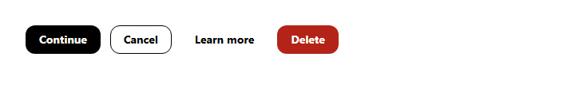

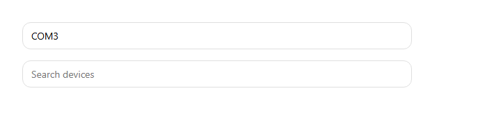

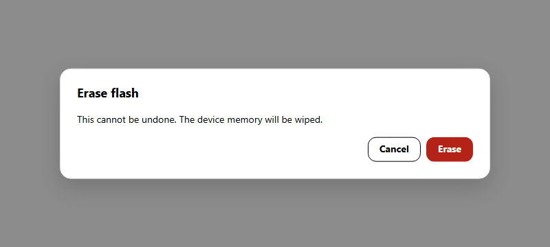

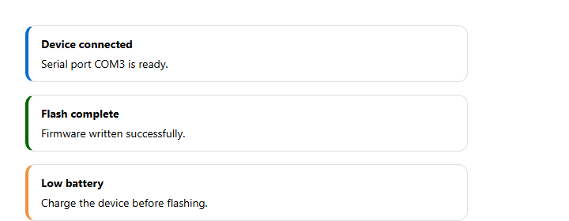

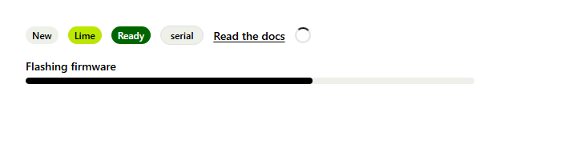

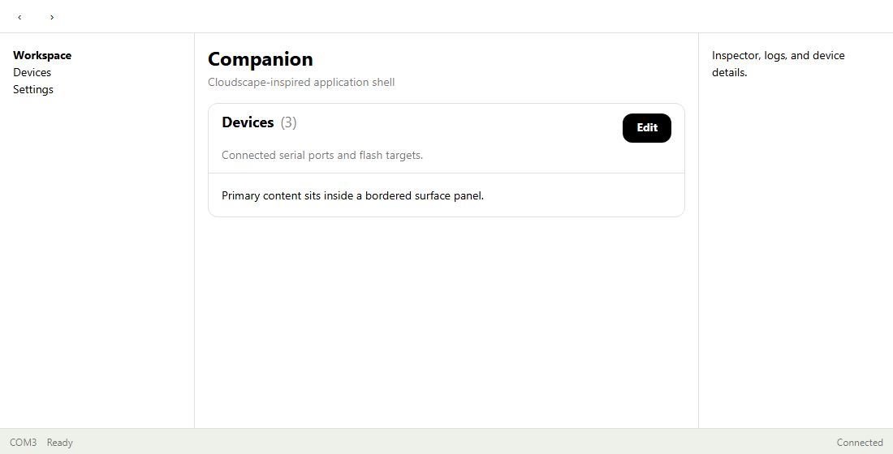

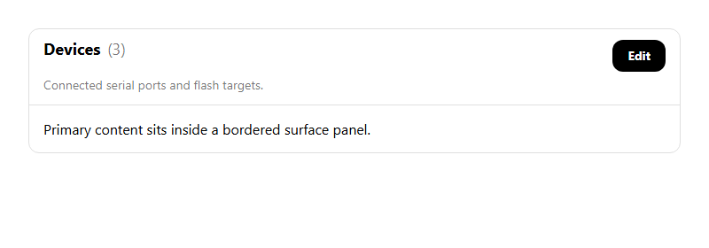

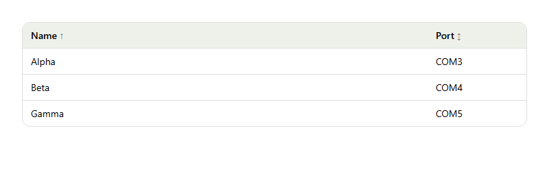

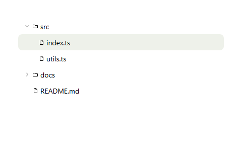

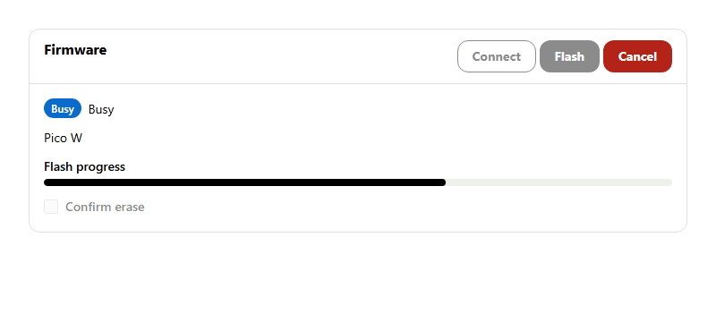

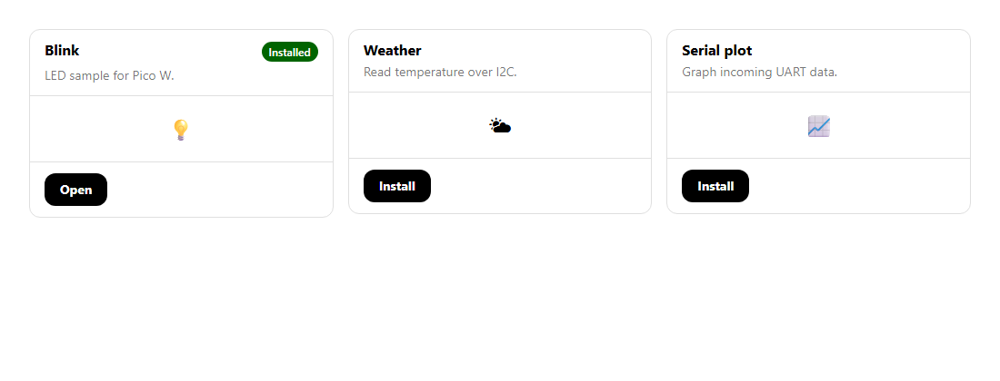

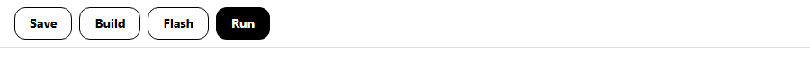

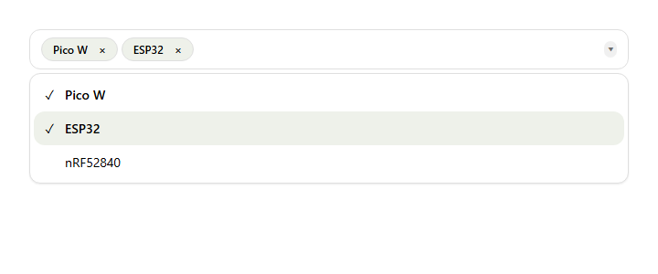
